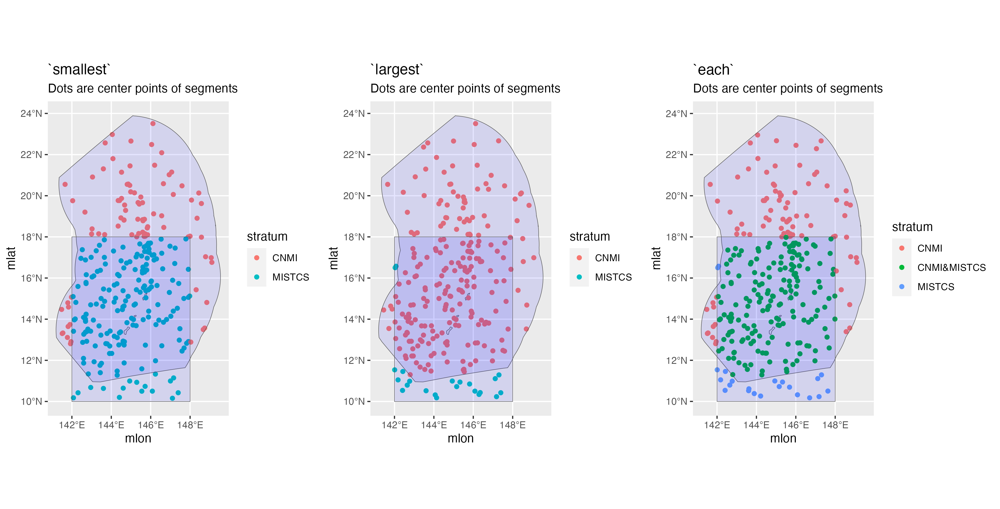

# Settings {#settings}


```{r, echo=FALSE, eval=TRUE, collapse=TRUE, include=FALSE}
library(dplyr)
library(magrittr)
library(LTabundR)
```

To customize the way data are processed and included in your analysis, use the `load_settings()` function. This function emulates and expands upon the settings file, `ABUND.INP`, that was used to run `ABUND7/9` in `FORTRAN`. `ABUND7/9` was a program written by Jay Barlow (NOAA Fisheries) to process `DAS` files.  
   
   
This function allows you to use 'factory defaults' if you don't wish to specify anything special such as strata or study area polygons:  

```{r, echo=TRUE, eval=TRUE, collapse=TRUE, size='tiny'}
settings <- load_settings()
```


If you do not want to use all the defaults, you can provide `load_settings()` with custom inputs. The function accepts three arguments:   

- `strata`: dataframe(s) of coordinates  

- `survey`: settings that will apply universally to the analysis   

- `cohorts`: settings that are specific to groups of species. By providing cohort-specific settings, the code for a single analysis becomes simpler and more easily reproduced, since the code only needs to be run once without modification. 


The output of `load_settings()` is a named list with a slot for each of these arguments:  

```{r, echo=TRUE, eval=TRUE, collapse=TRUE}
settings %>% names
```


## Survey strata {-}  

Stratum polygons can be provided as a named list of `data.frame` objects.  Each `data.frame` must have `Lon` and `Lat` as the first two columns, providing coordinates in decimal degrees in which West and South coordinates are negative. Other columns are allowed, but the first two need to be `Lon` and `Lat`.  The name of the slot holding the `data.frame` will be used as a reference name for the stratum.  It is acceptable if vertices in the eastern hemisphere are described using negative longitudes below -180, e.g., -185. (`LTabundR` will correct these to proper decimal degrees, e.g., -185 will become 175.)

If `strata` is `NULL`, abundance will not be estimated; only density within the searched area (i.e., the total segment length x effective strip width).  

While users are welcome to upload polygons of their own, the package comes with built-in polygons for strata that are commonly used in three NOAA Fisheries study regions in the central and eastern Pacific: the Central North Pacific (CNP, including Hawaii) ...

```{r, echo=TRUE, eval=TRUE, collapse=TRUE}
data(strata_cnp) 
names(strata_cnp)

# HI-EEZ: U.S. Exclusive Economic Zone around the Hawaiian Islands.
# OtherCNP: Extended Central North Pacific study area.
# MHI: Main Hawaiian Islands survey stratum during HICEAS 2002.
# WHICEAS: Study area for winter HICEAS of 2020.
# Spotted_OU: Stock boundary for the Oahu population of spotted dolphins.
# Spotted_FI: Stock boundary for the 4-Islands population of spotted dolphins.
# Spotted_BI: Stock boundary for the Hawaii Island population of spotted dolphins.
# Bottlenose_KaNi: Stock boundary for the Kauai/Niihau population of bottlenose dolphins.
# Bottlenose_OUFI: Collective stock boundaries for the adjacent Oahu and 4-Islands populations of bottlenose dolphins.
# Bottlenose_BI: Stock boundary for the Hawaii Island population of bottlenose dolphins.
# NWHI: Stock boundary for the Northwestern Hawaiian Islands population of false killer whales. 
```

...the California Current System (CCS) ...

```{r, echo=TRUE, eval=TRUE, collapse=TRUE}
data(strata_ccs) 
names(strata_ccs)

#For more information on these strata, see Barlow (2010).
```

... and the Eastern Tropical Pacific (ETP):  

```{r, echo=TRUE, eval=TRUE, collapse=TRUE}
data(strata_etp) 
names(strata_etp)

#For more information on these strata, contact <swfsc.info@noaa.gov> 
```

The package includes functions for visualizing and selecting from these strata. See the [Strata Gallery](#stratagallery) appendix.  

To create your own geostratum, you would use code like this:

```{r, echo=TRUE, eval=TRUE, collapse=TRUE}
# Create a dataframe of coordinates
# (this example is a closed rectangle)
mine1 <- data.frame(Lon = c(-120, -125, -125, -120, 120),
                           Lat = c(20,   20,   40,   40,   20))

# Make into a list
my_strata <- list(mine1 = mine1)

# Check it out
my_strata

# Supply to load_settings()
my_settings <- load_settings(strata = my_strata)
```

To keep some of the strata from `strata_cnp` then add one of your own design:  

```{r, echo=TRUE, eval=TRUE, collapse=TRUE}
# Subset `strata_cnp`:
my_cnp <- strata_cnp[c(2,3)]

# Check it out
my_cnp %>% names

# Create your new geostratum
mine1 <- data.frame(Lon = c(-120, -125, -125, -120, 120),
                           Lat = c(20,   20,   40,   40,   20))

# Assemble your list:
my_strata <- c(my_cnp, list(mine1 = mine1))

# Check it out
my_strata

# Supply to load_settings()
my_settings <- load_settings(strata = my_strata)
```


## Survey-wide settings {-}

Survey-wide settings apply universally to all species in the analysis.  

### Defaults {-}  

```{r, echo=TRUE, eval=TRUE, collapse=TRUE}
settings$survey
```

Defaults for the `survey` argument list are built up efficiently  using the function `load_survey_settings()` (see example code at bottom).

### Details {-}  

The `survey_settings` input accepts a list with any of the following named slots:  

- **`out_handling:`** the first slot allows you to specify how data occurring outside of geo-strata should be handled. If this is set to `"remove"`, those rows will be filtered out of the data early in the process. This reduces memory usage, speeds up processing, and gives you geographic control of how effort and sightings will be summarize.  If this is set to `"stratum"`, those data will be assigned to a fake geo-stratum, named `"out"`. Effort in the `"out"` stratum will not be segmentized, but `"out"` sightings will be processed and retained in the final datasets. This setting might be useful if you want to use `"out"` data for survey summaries and/or detection function estimation.  The default is `"remove"`, since that saves the most time and memory.  

- **`interpolate:`** This argument allows you to interpolate the `DAS` data at the onset of processing if your position updates are separated by large time intervals, which would make spatial effort and stratum assignments less exact. If this argument is `NULL`, then no interpolation will occur. If it is a number, e.g., 30, `LTabundR` will interpolate the data using simple-linear methods (i.e., no great-sphere calculations), such that position updates occur every 30 seconds or less. If adjacent `DAS` rows are from different dates or cruises, the interpolation routine will skip to the next pair of related rows.  Interpolation will only occur for On-Effort rows.  

- **`max_row_interval`:** The maximum alloweable time interval, in seconds, between rows before `LTabundR` assumes that there has been a break in survey data logging. The default is 900 seconds, or 15 minutes.  

- **`segment_method:`** This and the next few slots are devoted to controlling how effort will be "segmentized", or chopped into discrete sections for the purposes of estimating the variance of the density/abundance estimates. The two method options are `"day"` -- all effort within the same Cruise-StudyArea-Stratum-Year-Effort scenario will be binned into segments by calendar date -- and `"equallength"` -- effort within each unique effort scenario (Cruise-StudyArea-etc.) will be divided into segments of approximately equal length. See the [Appendix on segmentizing](#segmentizing) for details. 

- **`segment_target_km:`** if segmentizing by `"equallength"`, this field allows you to specify what that target length is, in km. The default is 150 km, the distance generally surveyed in one day on NOAA Fisheries surveys.    

- **`segment_max_interval:`** if segmentizing by `"equallength"`, this setting allows you to specify the time gaps in effort that are allowed to be contained within a single segment. For example, if your goal is a few large segments of equal length (e.g., 150-km segments, for bootstrap estimation of density variance), you are probably willing for discrete periods of effort to be concatenated into a single segment, even if the gaps between effort are as large as 1 or 2 days, in which case you would set `segment_max_interval` to 24 or 48 (hours), respectively.  However, if your goal is many smaller segments (e.g., 5-km segments, for habitat modeling), you want to ensure that effort is contiguous so that segment locations can be accurately related to environmental variables, in which case you would set `segment_max_interval` to be very small (e.g., .2 hours, or 12 minutes). Setting this interval to a small number, such as 0.2, also allows the segmentizing function to overlook momentary breaks in effort.  

- **`segment_remainder_handling:`** if segmentizing by `"equallength"`, periods of effectively-contiguous effort (as specified by `segment_max_interval`) are unlikely to be perfectly divisible by your `segment_target_km`; there is going to be a remainder. You can handle this remainder in three ways: (1) `"disperse"` allows the function to adjust `segment_target_km` so that there is in fact no remainder, effectively dispersing the remainder evenly across all segments within that period of contiguous effort; (2) `"append"` asks the function to append the remainder to a randomly selected segment, such that most segments are the target length with the exception of one longer one; or (3) `"segment"` asks the function to simply place the remainder in its own segment, placed randomly within the period of contiguous effort. This setting also has a second layer of versatility because it can accept a one- or two-element character vector. If a two-element vector is provided (e.g., `c("append","segment")`), the first element will be used in the event that the remainder is less than or equal to half your `segment_target_km`; if the remainder is more than half that target length, the second element will be used. This feature allows for replication of the segmentizing methods in [Becker et al. (2010)](https://www.int-res.com/abstracts/meps/v413/p163-183/).  

The remaining slots in `survey_settings` pertain to various datasets and settings used in data processing:  

- **`ship_list:`**  A `data.frame` containing a list of survey numbers and ship names. If not provided the default version, which was current as of the release of `ABUND9` in 2020, will be used (`data(ships)`), although note that surveys not included there will not be associated with a ship. Supplied `data.frames` must match the column naming structure of `data(ships)`.  

- **`species_codes:`** A `data.frame` containing species codes. This is an optional input, chiefly used to format species names in the reporting stage of the workflow (`lta_report()` especially). If missing, neither data processing nor line transect analysis will be obstructed. If the user supplies a `data.frame`, it must match the column naming structure of `data(species_codes)`.  

- **`group_size_coefficients:`** A `data.frame` of calibration factors. Find details in the subsection on processing sightings and [estimating group size](#ss_calibration).   

- **`smear_angles:`** If `TRUE` (the default is `FALSE`), bearing angles to a group of animals will be "smeared" by adding a uniformly distributed random number between -5 and +5 degrees. This has not been used in any recent analyses because observers have not been rounding angles as much as they used to. It was suggested by [Buckland et al. (2001)](https://distancesampling.org/whatisds.html#books) as a method for dealing with rounding which is especially influential when rounding to zero places many sightings at zero perpendicular distance. 


## Cohort-specific settings {-}

Cohort-specific settings apply only to a group of species. Since you can add as many cohorts to a `settings` object as you need, this allows you to stage your entire analysis and run your code once without modifying code or creating multiple versions of your code for each analysis of each cohort.  


### Defaults {-}  

The default is to use a single cohort for all species:  

```{r, echo=TRUE, eval=TRUE, collapse=TRUE}
settings$cohorts %>% names
```

Default values for the `default` cohort:  

```{r, echo=TRUE, eval=TRUE, collapse=TRUE}
settings$cohorts$default
```

Defaults for the `cohorts` argument list are built up efficiently  using the function `load_cohort_settings()` (see example code at bottom). 


### Details {-}  

The `cohort_settings` input accepts a list of any length. Each slot in that list can contain settings for a different cohort. Each cohort list can have any of the following named slots:  

- **`id:`** An informal identifier for this cohort, to help you keep track of which cohort is which.  For example, settings for a cohort of large whales species could be named `"big whales"`; settings for small delphinids and phocoenids could be named `"small_odontocetes"`; settings for beaked whales could be named `"beakers"`.  

- **`species:`** A character vector of species codes to include in this cohort. If `NULL` (the default), all species within the survey data will be included. Note that if you specify a vector, all species to be used in modeling a detection function for this cohort must be included here.  **For example,** in Hawaii the bottlenose dolphin is analyzed as part of a multi-species pool along with the rough-toothed dolphin, Risso's dolphin, and pygmy killer whale. However, the bottlenose dolphin has insular populations that need to be differentiated from their pelagic counterpart, which requires some special geostratum handling that behooves the preparation of a dedicated cohort for bottlenose dolphin. Even so, in the `cohort_settings` object for the bottlenose dolphin cohort, the species codes for the rough-toothed, Risso's, and pygmy-killer-whale dolphins need to be provided in this `species` argument. Conversely, in the `cohort_settings` object that holds most other species, including the rough-toothed, Risso's, and pygmy-killer-whale dolphins, the bottlenose dolphin's code still needs to be included in this `species` argument.

- **`strata:`** A character vector of geostratum names. These must match the names
listed in the `strata` slot of your survey settings (see documentation for `load_survey_settings()`). If `NULL` (the default), *all* geostrata in your survey settings will be used. This argument is an opportunity to subset the geostrata used for a cohort.  **For example,** as discussed above, certain dolphin species in Hawaiian waters have unique geostrata that apply only to their insular/pelagic populations, and should only have a role in breaking effort segments in the bootstrap variance analysis for these specific species. Those dolphins should be given their own cohort, and those insular/pelagic geostrata should be included in this `strata` argument. Conversely, all other species should be placed in a separate cohort and only the generic geostrata should be included in this `strata` argument. See the WHICEAS example below for a demonstration.

- **`probable_species:`** If `TRUE` (default is `FALSE`), the “probable” species identifications will be used in place of the “unidentified” categories. 

- **`sighting_method:`**	A coded integer which determines which sightings will be included based on how they were first seen.  Allowable codes are `0`=any method, `1`=with 25X only, `2`=neither with 25x binoculars nor from the helicopter (i.e., naked eyes and 7x binoculars only). These codes match those used in `ABUND7/9`.  

- **`cue_range:`**  Numeric vector of acceptable "observation cues" for sightings used in estimates of abundance. (`0`=this detail is missing in the data, `1`=associated birds, `2`=splashes, `3`=body of the marine mammal, `4`=associated vessel, `5`=?, `6`=blow / spout, `7`=associated helicopter). These codes match those used in `ABUND7/9`. 

- **`school_size_range:`**  Minimum and maximum group sizes to be included in estimates of abundance.  This is the overall group size, not the number of the given species that are present in a mixed-species group. 

- **`school_size_calibrate:`**  A logical (`TRUE` or `FALSE`) specifying whether or not to carry out group size adjustments according to the calibration table provided in `survey$group_size_coefficients` (if that table is provided). This setting allows you to toggle the survey-wide setting for certain cohorts. For example, perhaps you want to carry out calibration for a cohort of dolphin species, but not for a cohort of large whales whose group sizes tend to be smaller and easier to estimate accurately.  

- **`calibration_floor:`** A numeric indicating the minimum school size estimate for which group size calibration will be attempted. This pertains only to observers who do no have an entry in the `group_size_coefficients` table provided in `load_survey_settings()` (that table has a calibration floor for each observer). The default is 0, meaning that calibration will be attempted for *all* group size estimates, regardless of the raw estimate. 

- **`use_low_if_na:`**  If this setting is `TRUE`, and an observer(s) does not make a best estimate of group size, mean group size will be calculated from "low" estimates.  This will be done only if no observer has a "best" estimate.

- **`io_sightings:`** A coded integer which specifies how sightings by the independent observer will be handled.  Allowable codes, which are inherited from those used in `ABUND7/9`, are `"_1"`=include independent observer sightings wih all other sightings, `"0"`=ignore sightings by independent observer, `"1"`=use only sightings made by regular observer team WHEN an independent observer was present, `"2"`=include only sightings made by the independent observer.  IO sightings are typically used only for making g(0) estimates, otherwise IO sightings are usually ignored (code = `"0"`). 

- **`geometric_mean_group:`** This logical variable specifies whether to use a weighted geometric mean when calculating  mean group size.  [Barlow et al. (1998)](https://repository.library.noaa.gov/view/noaa/25848) found that this gave slightly better performance than an arithmetic mean group size for calibrated estimates. Default is `TRUE`, but a geometric mean will only be calculated if `group_size_coefficients` is not `NULL`. If `group_size_coefficients` is `NULL`, then an arithmetic mean will be calculated. (This setting does not apply to subgroup analyses.)

- **`truncation_km:`**  Specifies the maximum perpendicular distance for groups that could potentially be included for abundance estimation. This is not the stage at which you set the truncation distance for detection function modeling; it is simply a preliminary cutoff for sightings made at unrealiable detection distances. The default is set at 5.5 km, which is the maximum distance sightings are typically approached ("closing mode") during NOAA Fisheries surveys. 

- **`beaufort_range:`** Vector of Beaufort sea states (integers) that are acceptable in estimating the detection function and density. Beaufort data with a decimal place will be rounded to the nearest integer to evaluate for inclusion.  

- **`abeam_sightings:`** = If `TRUE`, sightings that occur aft of beam (i.e., 90 degrees) are included in estimating the detection function and densities. Default is `FALSE`: all abeam sightings will be ignored.

- **`strata_overlap_handling:`**  This setting informs how effort is split into segments when surveys cross stratum boundaries, and also which stratum name is assigned to each row of data. Note that the main impact of this setting is on how effort is broken into segments; the assigned stratum name is for display only and will not constrain options for including/excluding strata in analyses farther along in the `LTabundR` workflow. The default option is `"smallest"`, which means that effort will always be assigned to the smallest stratum when multiple strata overlap spatially. This is a safe option for surveys with "nested" strata (such as the Central North Pacific strata used by NOAA Fisheries; see below).

{width=75%}


Another option is `"each"`in which each time a stratum boundary is crossed the current segment will end and a new segment will begin. Also, stratum assignments for each row of effort will be shown as a concatenation of all the stratum layers overlapping at its position (e.g., "OtherCNP&HI_EEZ"). Note that the `"each"` option segmentizes effort in the exact same was as `"smallest"` when strata are fully nested; its main advantage is in dealing with partially overlapping strata (such as strata used in the Marianas Archipelago; see below). 

The third option is `"largest"`, in which the largest of overlapping strata is used to assign a stratum name to each row. (We are not sure what use case this would serve, but we offer it as an option for niche analyses.)




- **`distance_types:`**  A character vector of the effort types that will be included in detection function estimation and density estimation, and therefore considered in effort segmentizing.  Accepted values are `"S"` (systematic/standard effort), `"F"` (fine-scale effort), and `"N"` (non-systematic/non-standard effort, in which systematic protocols are being used but effort is not occurring along design-based transect routes).  The default values are `c("S","F","N")`.  

- **`distance_modes:`**  The effort modes that will be included in detection function estimation and density estimation, and therefore considered in effort segmentizing. Accepted values are `"P"` (passing) and `"C"` (closing), and the default values are `c("P","C")`.  

- **`distance_on_off:`** The value(s) of `OnEffort` (On Effort is `TRUE`, Off Effort is `FALSE`) that will be included in detection function estimation and density estimation, and therefore considered in effort segmentizing. Default is `TRUE` only. (We don't expect `FALSE` or `c(TRUE,FALSE)` to be used much, if at all, but we make this option available).  


## Example code {-}  

### Use settings defaults {-}  

No strata or group size calibration.  

```{r, echo=TRUE, eval=FALSE, collapse=TRUE}
settings <- load_settings()
```

### Use settings defaults, but with strata {-}  

```{r, echo=TRUE, eval=FALSE, collapse=TRUE}
# Load strata dataframes
data(strata_cnp)

settings <- load_settings(strata = strata_cnp)
```

### Customize survey, but not cohorts  {-}

This code will process survey data such that effort segments are 5 km in length, with any effort falling outside of the provided geostrata relegated to a virtual geostratum named `"out"`. Since a cohort is not specified, the default values will be used.  

```{r, echo=TRUE, eval=FALSE, collapse=TRUE}
# Load built-in datasets
data(strata_cnp)
data(group_size_coefficients)
data(ships)
data(species_codes)

# Survey settings
survey <- 
  load_survey_settings(out_handling = 'stratum',
                       max_row_interval = 700,
                       segment_method = 'equallength',
                       segment_target_km = 5,
                       segment_max_interval = .3,
                       segment_remainder_handling = c('append','segment'),
                       ship_list = ships,
                       species_codes = species_codes,
                       group_size_coefficients = group_size_coefficients,
                       smear_angles = FALSE)

# Load settings
settings <- load_settings(strata = strata_cnp,
                          survey)
```


### Fully custom: WHICEAS case study  {-}

These are the settings we will use in the remainder of the tutorial. 

#### Survey-wide settings {-} 

To emulate the analysis done in [Bradford et al. (2021)](https://repository.library.noaa.gov/view/noaa/47788), we want to process effort with 150-km segments, relegating any remainder to its own segments. We also want to make sure to remove any survey data that falls outside of the geostrata, to ensure that detection functions are regionally specific. We will use the built-in tables for species codes, ship codes, and group size calibration coefficients. 

```{r, echo=TRUE, eval=TRUE, collapse=TRUE}
data(species_codes)
data(ships)
data(group_size_coefficients)

survey <- load_survey_settings(
  out_handling = 'remove',
  max_row_interval = Inf,
  segment_method = "equallength",
  segment_target_km = 150,
  segment_max_interval = 24,
  segment_remainder_handling = c("segment"),
  ship_list = ships,
  species_codes = species_codes,
  group_size_coefficients = group_size_coefficients,
  smear_angles = FALSE
)
```

#### Geostrata {-} 

We will use the built-in dataset of Central North Pacific geostrata: 

```{r, echo=TRUE, eval=TRUE, collapse=TRUE}
data(strata_cnp)
strata_cnp %>% names
```

#### Species cohorts {-} 

**Cohort 1: All species**  
At least one cohort needs to be specified in order to run process survey data, so this first cohort will serve as a 'catch-all' for species who do not need special handling. It does not hurt to include *all* species in this catch-all cohort -- except perhaps by increasing the file-size of your processed data by a few kilobytes -- *even if* you will be creating a separate, dedicated cohort for one of these species downstream. Having a catch-all cohort like this serves two purposes: (1) it avoids unforeseen complications if you will be modeling detection functions with multi-species pools, as mentioned above; and (2) it will simplify the code you will use to produce summary statistics of effort and sightings totals, since you will not need to pool together statistics from multiple cohorts.  

To build this catch-all cohort, we will not specify any species so that *all* species in the data are included, and we will specify that only the generic geostrata should be used, so that species specific insular stock boundaries are ignored.  

Here we show all possible inputs. Most of these match the built-in defaults. Those that do not (there are just 4) are noted with a commented asterisk. 

```{r, echo=TRUE, eval=TRUE, collapse=TRUE}
all_species <- load_cohort_settings(
  id = "all", # *
  species = NULL, 
  strata = c('WHICEAS', 'HI_EEZ', 'OtherCNP'), # *
  probable_species = FALSE,
  sighting_method = 0,
  cue_range = 0:7,
  school_size_range = c(0, 10000),
  school_size_calibrate = TRUE,
  calibration_floor = 0,
  use_low_if_na = TRUE, # *
  io_sightings = 0,
  geometric_mean_group = TRUE,
  truncation_km = 7.5, # *
  beaufort_range = 0:6,
  abeam_sightings = FALSE, 
  strata_overlap_handling = c("smallest"),
  distance_types = c('S','F','N'),
  distance_modes = c('P','C'),
  distance_on_off = TRUE
)

```

**Cohort 2: Bottlenose dolphin**  
As mentioned above, bottlenose dolphins are going to be analyzed as part of a multi-species pool that includes the rough-toothed dolphin, Risso's dolphin, and pygmy killer whale. Because those species' codes will be needed to model the detection function used in bottlenose dolphin density/abundance estimation, those species codes will be included in this cohort's settings.    

Also mentioned above: Hawaii has a pelagic population of bottlenose dolphins as well as several distinct insular stocks. In this case study, we are interested in estimating only the abundance of the pelagic population, which means we will need to include geostrata of the insular stock boundaries in order to make sure the effort and sightings within those insular areas are ignored. That means we will specify the generic geostrata (`"WHICEAS"`, `"HI_EEZ"`, and `"Other_CNP"`), as well as the geostrata for the insular stocks. 

We can spell out as many any inputs that we wish, but here will only show the inputs that are non-default and/or different from Cohort 1 above.  

```{r, echo=TRUE, eval=TRUE, collapse=TRUE}
bottlenose <- load_cohort_settings(
  id = "bottlenose",
  species = c('015', '018', '021', '032'),
  strata = c('WHICEAS', 'HI_EEZ', 'OtherCNP',
             'Bottlenose_BI', 'Bottlenose_OUFI', 'Bottlenose_KaNi'),
  use_low_if_na = TRUE,
  truncation_km = 7.5)
```

**Cohort 3: Pantropical spotted dolphin**   
Similar to the bottlenose dolphin above, spotted dolphins in Hawaiian waters belong to pelagic stocks as well as insular stocks.  We will be estimating density/abundance for the only pelagic stocks here, but we need to include the geostrata for the insular stocks in order to ignore their effort and sightings.  

```{r, echo=TRUE, eval=TRUE, collapse=TRUE}
spotted <- load_cohort_settings(
  id = "spotted",
  species = '002',
  strata = c('WHICEAS', 'HI_EEZ', 'OtherCNP',
             'Spotted_OU','Spotted_FI','Spotted_BI'),
  use_low_if_na = TRUE,
  truncation_km = 7.5)
```

#### Compile settings {-} 

Finally, we create our `settings` object, providing `cohorts` as a list of lists: 

```{r, echo=TRUE, eval=TRUE, collapse=TRUE}
settings <- load_settings(strata = strata_cnp,
                          survey = survey,
                          cohorts = list(all_species,
                                         bottlenose,
                                         spotted))
```

Save this `settings` object locally, to use in downstream scripts:  

```{r, echo=TRUE, eval=TRUE, collapse=TRUE}
save(settings, file='whiceas_settings.RData')
```
