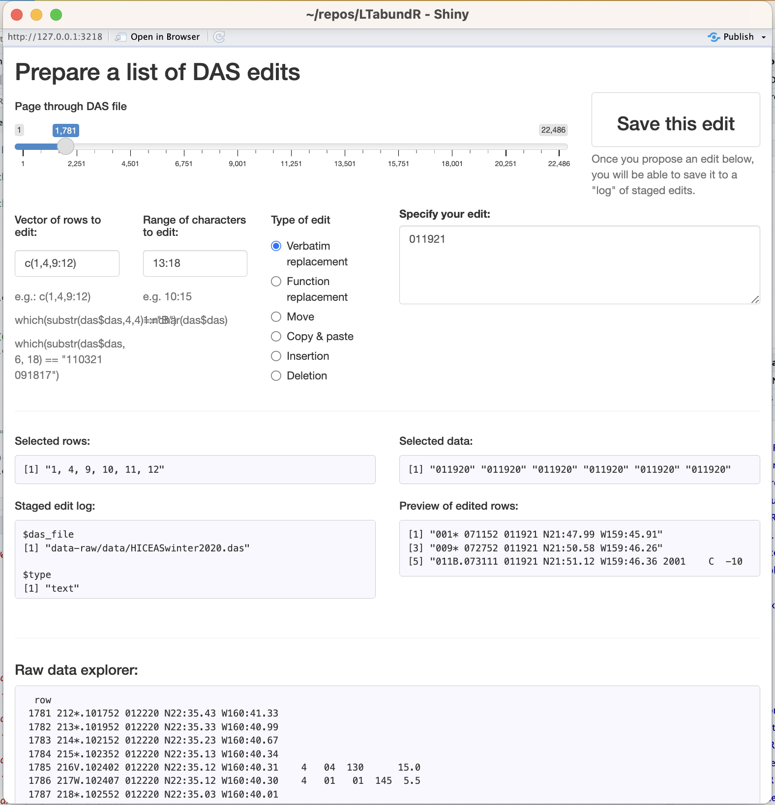
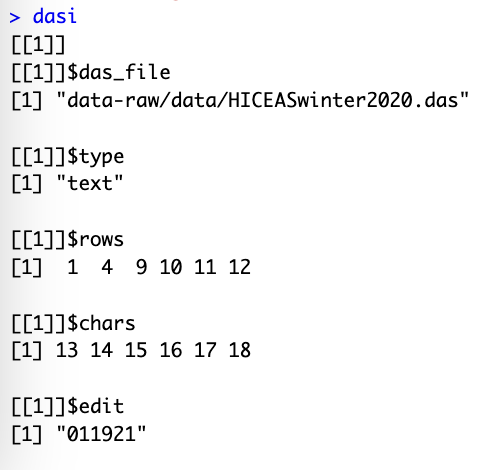

# DAS editing {#das}


```{r, echo=FALSE, eval=TRUE, collapse=TRUE, include=FALSE}
library(dplyr)
library(magrittr)
library(LTabundR)

run_from_scratch <- FALSE
```

The `LTabundR` package includes several functions that facilitate the exploration of `DAS` files of `WinCruz` survey data, as well as a function that allows you to apply "edits" to the survey data in a reproducible way (i.e., using code, without modifying the actual data file). 

## Reviewing a `DAS` file {-}

### `das_readtext()` {-} 

The `swfscDAS` package has functions for reading in a `DAS` file and parsing it into columns of fixed-width text. To complement those functions, `LTabundR` includes the function `das_readtext()`, which reads in a `DAS` file without applying any column parsing, so that the data can be read in its true raw format. 

```{r, echo=TRUE, eval=TRUE, message=TRUE, collapse=TRUE}
# Local path to DAS file
das_file <- 'data/surveys/CenPac1986-2020_Final_alb.das'

das <- das_readtext(das_file)
das$das %>% head(20)
```

To follow along, this data file can be downloaded [here](https://raw.githubusercontent.com/emk-noaa/LTAvignette/main/data/surveys/CenPac1986-2020_Final_alb.das).

### `das_inspector()` {-} 

We also provide a function, `das_inspector()`, that allows you to explore a `DAS` file within an interactive `Shiny` app. This app can also be used to find, prepare, and preview coded edits to the `DAS` data. 

```{r, echo=TRUE, eval=FALSE, message=TRUE, collapse=TRUE}
dasi <- das_inspector(das_file)
```

In this app, you specify the rows and 'columns' (i.e., character indices) that will be affected by your edit, the edit you want to apply, and the type of edit it will be (see next subsection).   

*A screenshot of the `das_inspector()` app:* 
{width=95%}. 

## Staging edits {-}  

The interactive app launched by the `das_inspector()` function, introduced above, allows you to prepare and preview edits to your `DAS` data. Once you have an edit prepared and previewed within the app, you can then "save" that edit with the click of a button, and when you close the app your log of staged edits will be returned as a `list`.  
 
  
*Here is the list produced from the edit staged in the screenshot above:*  

{width=30%}. 


For this reason, it can be useful to type the above command such that the output is saved into an object; in the example above we saved the output into an object named `dasi`. You can then pass this list of edits to `das_editor()` (next subsection on this page), or as an argument within `process_surveys()` (next page).  

**However,** for the sake of full code reproducibility, it may be most useful to use this output to manually write coded edits into an `R` script, as demonstrated in the remainder of this section, which you can then use for the next stages of data processing. 

Below we step through various types of edits that can be applied to a `DAS` file. We show you how to format the staged edit, then we use the `LTabundR` function `das_editor()` to show the result of applying the edit. We discuss `das_editor()` in detail in the next section of this chapter. 

The `das_editor()` function can currently handle 6 types of edits, which we shall demonstrate below. 


### Types of editing {-} 

To demonstrate the types of editing actions that can be achieved through `das_editor()`, we will use the `DAS` file from the 2020 WHICEAS survey (you can download [here](https://raw.githubusercontent.com/emk-noaa/LTAvignette/main/data/surveys/HICEASwinter2020.das)).  

```{r, echo=TRUE, eval=TRUE, message=TRUE, collapse=TRUE}
# Local path to das_file
das_file <- "data/surveys/HICEASwinter2020.das"
das <- das_readtext(das_file)
```

#### Verbatim text replacement {-}  

The `edit` will be interpreted verbatim as text that will replace the specified data. 

```{r, echo=TRUE, eval=TRUE, message=TRUE, collapse=TRUE}
edits <- list(list(das_file = das_file, 
                   type = 'text',
                   rows = 10:15, 
                   chars = 20:39, 
                   edit = 'lat, lon'))
```

Here is what this edit log object will look like: 

```{r, echo=TRUE, eval=TRUE, message=TRUE, collapse=TRUE}
edits
```

And here is the effect it will have: 

```{r, echo=TRUE, eval=TRUE, message=TRUE, collapse=TRUE}
# Before
das$das[9:16]

# After
dase <- das_editor(edits)
dase$das[[1]]$das$das[9:16]
```

#### Function-based text replacement {-}  

The `edit` will be evaluated as a function that is applied to the specified characters in each of `rows`. 

```{r, echo=TRUE, eval=TRUE, message=TRUE, collapse=TRUE}
edits <- list(list(das_file = das_file, 
                   type = 'function',
                   rows = 10:15, 
                   chars = 20:39, 
                   edit = 'tolower'))

# Before
das$das[9:16]

# After
dase <- das_editor(edits)
dase$das[[1]]$das$das[9:16]
```

A special application of this form of editing is adjusting timestamps using the `LTabundR` function `das_time()`.  In this next example, we subtract an hour from the first 5 rows of timestamps:

```{r, echo=TRUE, eval=TRUE, message=TRUE, collapse=TRUE}
edits <- list(list(das_file = das_file, 
                   type = 'function',
                   rows = 1:5, 
                   chars = 6:40, 
                   edit = 'function(x){das_time(x, tz_adjust = -1)$dt}'))

# Before
das$das[1:6]

# After
dase <- das_editor(edits)
dase$das[[1]]$das$das[1:6]
```

In the event that a survey was conducted using UTC timestamps instead of local time, you can adjust each timestamp according to its actual timezone as determined from its corresponding lat/long coordinates. Let's say the first 5 timestamps were collected in UTC by accident. The following code could correct that mistake:  

```{r, echo=TRUE, eval=TRUE, message=TRUE, collapse=TRUE}
edits <- list(list(das_file = das_file, 
                   type = 'function',
                   rows = 1:5, 
                   chars = 6:40, 
                   edit = 'function(x){das_time(x, tz_adjust = "from utc")$dt}'))

# Before
das$das[1:6]

# After
dase <- das_editor(edits)
dase$das[[1]]$das$das[1:6]
```

#### Moving data {-}  

The `rows` will be deleted from their current location and pasted immediately below the row number specified by `edit`. The moved rows will be given the same date, time, latitude, and longitude, as the `edit` row.
 
```{r, echo=TRUE, eval=TRUE, message=TRUE, collapse=TRUE}
edits <- list(list(das_file = das_file, 
                    type = 'move',
                    rows = 10, 
                    chars = NULL, 
                    edit = 15))

# Before
das$das[9:16]

# After
dase <- das_editor(edits)
dase$das[[1]]$das$das[9:16]
```

#### Copying & pasting data {-}  

The `rows` will be copied from their current location and pasted immediately below the row number specified by `edit`. The pasted `rows` will be given the same date, time, latitude, and longitude, as the `edit` row. 

```{r, echo=TRUE, eval=TRUE, message=TRUE, collapse=TRUE}
edits <- list(list(das_file = das_file, 
                   type = 'copy',
                   rows = 10, 
                   edit = 15))

# Before
das$das[9:17]

# After
dase <- das_editor(edits)
dase$das[[1]]$das$das[9:17]
```

#### Inserting data {-}  

The text provided in edit will be inserted verbatim immediately below the first of the rows provided.  

```{r, echo=TRUE, eval=TRUE, message=TRUE, collapse=TRUE}
edits <- list(list(das_file = das_file, 
                   type = 'insert',
                   rows = 10, 
                   edit = "SEQ* HHMMSS MMDDYY NDG:MI.NT WDEG:MI.NT"))
# Before
das$das[9:16]

# After
dase <- das_editor(edits)
dase$das[[1]]$das$das[9:16]
```

#### Deleting data {-}  

The specified `rows` will be deleted.  

```{r, echo=TRUE, eval=TRUE, message=TRUE, collapse=TRUE}
edits <- list(list(das_file = das_file, 
                   type = 'delete',
                   rows = 10))

# Before
das$das[9:16]

# After
dase <- das_editor(edits)
dase$das[[1]]$das$das[9:16]
```

### Actual edits {-}  

The above examples were silly demonstrations of the types of edits that can be handled by `das_editor()`. Here we show the preparation of four edits that we will actually use when we process surveys on the next page.  

These edits will be applied to the following `DAS` file of survey data from 1986-2020: 

```{r, echo=TRUE, eval=TRUE, message=TRUE, collapse=TRUE}
# Local path to das_file
das_file <- 'data/surveys/CenPac1986-2020_Final_alb.das'
das <- das_readtext(das_file)
```

#### Cruise 1607 sighting 55 {-}

This sighting, at sequence ID `032` below, currently triggers errors in `swfscDAS` due to a manually entered `R` event a few lines above that does not have the `P` (observer positions) event that typically follows it. Without tht `P` entry, the observer positions of the sighting are unknown.  

```{r, echo=TRUE, eval=TRUE, message=FALSE, collapse=TRUE}
das[128111:128125,] 
```

(Note that we used `das_inspector()` to get the row numbers for this region of the data.)  

To fix this, we can stage an edit that copies the `P` line that occurs minutes earlier and pastes that line just below the rogue `R` line. 

```{r, echo=TRUE, eval=TRUE, message=TRUE, collapse=TRUE}
edit_1607_55 <- 
  list(das_file = das_file,
       type = 'copy',
       rows = 128111,
       chars = NULL,
       edit = 128118)
```

Here is what this change will look like: 

```{r, echo=TRUE, eval=TRUE, message=TRUE, collapse=TRUE}
dase <- das_editor(list(edit_1607_55))
dase$das[[1]]$das$das[128111:128123]
```

#### Cruise 1607 sighting 68 {-} 

This sighting faces a similar issue: a rogue `R` event without the follow-up `P` event. This case is also missing the follow-up `V` event (viewing conditions).  

```{r, echo=TRUE, eval=TRUE, message=FALSE, collapse=TRUE}
das[129980:129993,] 
```

To fix this we will stage a similar edit, this time copying and pasting two rows (`P` and `V` events) below the rogue `R` event: 

```{r, echo=TRUE, eval=TRUE, message=TRUE, collapse=TRUE}
edit_1607_68 <- 
  list(das_file = das_file, 
       type = 'copy',
       rows = c(129982, 129983 , 129985),
       chars = NULL,
       edit = 129987)
```

Preview of change: 

```{r, echo=TRUE, eval=TRUE, message=TRUE, collapse=TRUE}
dase <- das_editor(list(edit_1607_68))
dase$das[[1]]$das$das[129982:129995]
```

#### Cruise 1621 sighting 245 {-} 

This is another case of a rogue `R` event, again missing both the requisite `P` and the `V` post-`R` events. 

```{r, echo=TRUE, eval=TRUE, message=FALSE, collapse=TRUE}
das[271930:271939,] 
```

Staged edit: 

```{r, echo=TRUE, eval=TRUE, message=TRUE, collapse=TRUE}
edit_1621_245 <- 
  list(das_file = das_file, 
       type = 'copy',
       rows = 271932:271933,
       chars = NULL,
       edit = 271937)
```

Preview of change: 

```{r, echo=TRUE, eval=TRUE, message=TRUE, collapse=TRUE}
dase <- das_editor(list(edit_1621_245))
dase$das[[1]]$das$das[271930:271941]
```


#### Timestamp issues with Cruise 1004 {-} 

This edit will correct for the fact that all of Cruise 1004 was conducted using UTC timestamps instead of local timestamps. 

```{r, echo=TRUE, eval=TRUE, message=TRUE, collapse=TRUE}
edit_1004_utc <- 
  list(das_file = das_file, 
       type = 'function',
       rows = 433327:437665, 
       chars = 6:39, 
       edit = 'function(x){das_time(x, tz_adjust = "from utc")$dt}')
```

```{r, echo=TRUE, eval=TRUE, message=TRUE, collapse=TRUE}
# Before
das$das[433326:433330] # beginning of cruise
das$das[437664:437667] # end of cruise
```

```{r, echo=FALSE, eval=run_from_scratch, message=TRUE, collapse=TRUE}
# After
edits <- list(edit_1004_utc)
dase <- das_editor(edits)
dase$das[[1]]$das$das[433326:433330]
dase$das[[1]]$das$das[437664:437667]
save(dase, file='edit_1004.RData')
```

```{r, echo=TRUE, eval=FALSE, message=TRUE, collapse=TRUE}
dase <- das_editor(list(edit_1004_utc))
```

```{r, echo=FALSE, eval=TRUE, message=TRUE, collapse=TRUE}
load(file='edit_1004.RData')
```

```{r, echo=TRUE, eval=TRUE, message=TRUE, collapse=TRUE}
# After
dase$das[[1]]$das$das[433326:433330]
dase$das[[1]]$das$das[437664:437667]
```

Note that this type of edit can be dangerous, however, since ships can cross time zone boundaries mid-day, potentially repeating timestamps and giving the appearance that the `DAS` data is out of chronological order, which may bring about consequences for data processing that are difficult to predict. 

This type of edit is also time-consuming; since the time zone needs to be calculated in each `DAS` row individually, this edit could take >20 minutes to process. An expedited (and safer) approximation of this edit would be to simply adjust the timezone by the GMT offset for Guam (UTC + 10 hours).  

```{r, echo=TRUE, eval=TRUE, message=TRUE, collapse=TRUE}
edit_1004_gmt10 <- 
  list(das_file = das_file, 
       type = 'function',
       rows = 433327:437665, 
       chars = 6:39, 
       edit = 'function(x){das_time(x, tz_adjust = 10)$dt}')

dase <- das_editor(list(edit_1004_gmt10))

dase$das[[1]]$das$das[433326:433330]
dase$das[[1]]$das$das[437664:437667]
```

#### Combining and saving edits {-}  

Finally, we will collect these edits into a single `list` and save them for use during survey processing (next page).  

```{r, echo=TRUE, eval=TRUE, message=TRUE, collapse=TRUE}
# Combine
edits <- list(edit_1607_55,
              edit_1607_68,
              edit_1621_245,
              #edit_1004_utc,
              edit_1004_gmt10)

# Save
saveRDS(edits,file='cnp_1986_2020_edits.RData')
```


## Applying edits {-}

The `das_editor()` function allows you to apply edits to a `DAS` file without modifiyng the original data. You supply edits to this function as a set of instructions saved within a `list` object. As explained in the previous section, you can prepare these instructions manually or use the `das_inspector()` function above to get help. For the sake of reproducibility we recommend documenting your edits as code in a script, then saving all the edits into a single list (see the previous `R` chunk above). Note that there is no limit to the number of edits that can be provided in a single `list`, and they can be provided in any order. When the edits are applied, the `LTabundR` function will sort the edits by `DAS` file and by edit type, and then apply edits in increasing order of "disruption", i.e., text replacements first, then moving rows of data (no net change in number of rows), then copying-pasting, inserting, and deleting.   

`LTabundR` provides two functions for applying these staged edits: **`das_editor()`** and **`das_editor_tofile()`**. The former is a simple function that applies edits then returns the modified `DAS` data directly to the `R` console. It is a handy function for testing that a specific edit makes the intended changes successfully. The latter function, `das_editor_tofile()`, applies the edits then saves new versions of the `DAS` file. Those new files can then be passed to the data processing functions described in the next chapter. (See the next chapter for examples of how to use `das_editor_tofile()`.  

In summary, we recommend `das_editor()` for preparing each individual edit, and `das_editor_tofile()` when you are ready to apply all edits and move on to data processing.  

Note that the original `DAS` file is *never* modified or replaced. The edited `DAS` filename will have a suffix to indicate that it is an edited version of the data. This allows survey data to be modified reproducibly before being processed with `LTabundR::process_surveys()` without touching the original `DAS` data files or requiring analysts to duplicate files and make one-off modifications manually.


