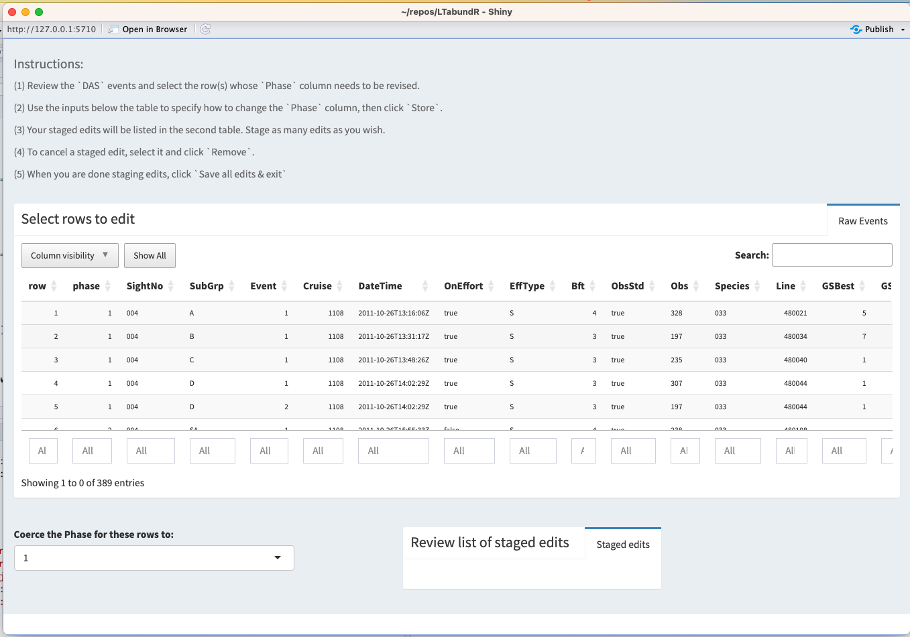

# Data processing {#processing}

```{r, echo=FALSE, eval=TRUE, collapse=TRUE, include=FALSE}
library(dplyr)
library(ggplot2)
library(plotly)
library(magrittr)
library(LTabundR)
library(swfscDAS)

load('whiceas_settings.RData')

rerun_from_scratch <- FALSE
# If you want to confirm the package works, change to TRUE.
# If you already know it does, change to FALSE so that knitting is quick
# (it will use saved R objects instead of producing them anew)
```

In our WHICEAS case study example, we are interested in estimating density/abundance for 2017 and 2020 only, but we want to use surveys from previous years to help model species detection functions. We will therefore be using a dataset of NOAA Fisheries surveys in the Central North Pacific from 1986 to 2020.  

```{r, echo=TRUE, eval=TRUE, collapse=TRUE}
# Local path to DAS file
das_file <- 'data/surveys/CenPac1986-2020_Final_alb.das'
```

To follow along, this data file can be downloaded [here](https://raw.githubusercontent.com/emk-noaa/LTAvignette/main/data/surveys/CenPac1986-2020_Final_alb.das).

You can process your survey data using a single function, **`process_surveys()`**, which takes two primary arguments: the filepath(s) to your `DAS` survey data, and your `settings` object. For example:  

```{r, echo=TRUE, eval=FALSE, collapse=TRUE}
cruz <- process_surveys(das_file, 
                        settings)
```

That single command will convert your raw `DAS` data to a "`cruz`" object, a list of polished datasets that are prepared to be passed to subsequent analyses.  

In our case we will use a third argument to apply edits to the `DAS` data before processing (see previous page for details on those edits): 

```{r, echo=TRUE, eval=TRUE, collapse=TRUE}
edits <- readRDS('cnp_1986_2020_edits.RData')
```

```{r, echo=TRUE, eval=rerun_from_scratch, collapse=TRUE}
cruz <- process_surveys(das_file, 
                        settings,
                        edits)
```

```{r, echo=FALSE, eval=rerun_from_scratch, collapse=TRUE}
# discretely save this, to make it easier to knit later
save(cruz,file='whiceas_cruz.RData')

# Confirm that 1004 timestamps have been fixed
#cruz$cohorts$all$das %>% 
#  filter(Cruise == 1004) %>% 
#  mutate(hr = lubridate::hour(DateTime)) %>% 
#  pull(hr) %>% 
#  hist
```

## Behind the scenes {-} 

The `process_surveys()` function is a wrapper for several discrete stages of data formatting/processing. Behind the scenes, each of those stages is carried out using a specific `LTabundR` function. The remainder of this page is a detailed step-by-step explanation of the data processing that occurs when you call `process_surveys()`.  

### Edit cruise data {-}

If the `edits` input argument is supplied to `process_surveys()`, temporary copies of the `DAS` file(s) are made and edited before processing. This step is discussed on the previous page and implemented with the function `das_editor_tofile()`:  

```{r, echo=TRUE, eval=TRUE, collapse=TRUE}
das_file <-
    das_editor_tofile(das_file,
                      edits,
                      suffix = '_edited_example',
                      verbose = TRUE)
```

This function produces new `DAS` files with the edits applied, and returns an updated set of `DAS` filenames you can pass to the next stage of data processing.  
```{r, echo=TRUE, eval=TRUE, collapse=TRUE}
das_file
```

### Bring in cruise data {-} 

Read in and process your `.DAS` file using the functions in Sam Woodward's `swfscDAS` package. To do so quickly, we built a wrapper function that makes this quick and easy: 

```{r, echo=TRUE, eval=rerun_from_scratch, collapse=FALSE}
das <- das_load(das_file, 
                perform_checks = TRUE,
                print_glimpse = TRUE)
```

### Interpolate cruise data {-}

Run the following function if you wish to interpolate the `DAS` data to a more frequent time interval, which can be useful for stratum assignment and effort calculations in some circumstances.  This is only done in `process_surveys()` if the `settings` object passed to it has the `interpolate` input for `load_survey_settings()` set to a number (indicating the desired interval in seconds). In this example the interval is set to 120 seconds.  Interpolation will only occur for On-Effort rows.  

```{r, echo=TRUE, eval=FALSE, collapse=FALSE}
das <- das_interpolate(das, new_interval = 120)
```


### Process strata {-}  

Run the following function to add strata and study-area information to each row of `DAS` data:  

```{r, echo=TRUE, eval=rerun_from_scratch, collapse=TRUE}
das_strata <- process_strata(das, settings)
```

This function loops through each stratum `data.frame` you have provided it in `settings$strata`, formats the stratum, and asks whether each DAS row occurs within it. For each stratum, a column named `stratum_<StratumName>` is added to the `das` object; each row in this column is `TRUE` (included) or `FALSE`.

### Format `DAS` data into a `cruz` object {-}  

The function `das_format()` takes care of some final formatting and initiates the `cruz` object data structure. 

```{r, echo=TRUE, eval=rerun_from_scratch, collapse=TRUE}
cruz <- das_format(das_strata, verbose=TRUE)
```

This function (1) removes rows with invalid Cruise numbers, times, or locations; (ii) calculates the distance, in km, between each row of data; (iii) adds a `ship` column to the dataset, with initials for the ship corresponding to each cruise; (iv) creates a new list, `cohorts`, which copies the cruise data for each cohort specified in your settings; and (v) adds a `stratum` column to the data in each cohort. That column specifies 
a single stratum assignment for each row of `DAS` data in the event of overlapping strata, based upon the cohort setting `stratum_overlap_handling`.  

```{r, echo=FALSE, eval=rerun_from_scratch, collapse=TRUE}
# discretely save this, to make it easier to knit later
save(cruz,file='whiceas_cruz_format.RData')
```

```{r, echo=FALSE, eval=TRUE, collapse=TRUE}
# discretely load saved version
load('whiceas_cruz_format.RData')
```

### The `cruz` object {-}

The function `das_format()` returns a list, which we have saved in an object named `cruz`, with several slots:  

```{r, echo=TRUE, eval=TRUE, collapse=TRUE}
cruz %>% names
```

The slots `strata` and `study_area` provide the area, in square km, of each polygon being used:  

```{r, echo=TRUE, eval=TRUE, collapse=TRUE}
cruz$strata
```

The slot `cohorts` is itself a list with one slot for each cohort. The slots are named using the `id` cohort setting.  

```{r, echo=TRUE, eval=TRUE, collapse=TRUE}
cruz$cohorts %>% names
```

Each cohort slot has a copy of the `DAS` data with a new `stratum` column, which contains a stratum assignment tailored to its cohort-specific settings. For instance, the `all` cohort, whose `stratum_overlap_handling` is set to `"smallest"`, assigns the smallest stratum in the event of overlapping or nested strata:

```{r, echo=TRUE, eval=TRUE, collapse=TRUE}
cruz$cohorts$all$stratum %>% table(useNA='ifany')
```

Since the `bottlenose` cohort uses a different subset of geostrata, its distribution of stratum assignments will also differ:

```{r, echo=TRUE, eval=TRUE, collapse=TRUE}
cruz$cohorts$bottlenose$stratum %>% table(useNA='ifany')
```

This list, with these three primary slots, will be referred to from hereon as a `cruz` object. 


### Segmentize the data {-} 

To allocate survey data into discrete 'effort segments', which are used in variance estimation in subsequent steps, run the function `segmentize()`. This process is controlled by both survey-wide and cohort-specific [settings]{#settings}, which are now carried in a slot within the `cruz` object.  The process is outlined in detail in the [Appendix on Segmentizing](#segmentizing).

```{r, echo=TRUE, eval=rerun_from_scratch, collapse=TRUE}
cruz <- segmentize(cruz, verbose=FALSE)
```

```{r, echo=FALSE, eval=rerun_from_scratch, collapse=TRUE}
# discretely save this, to make it easier to knit later
save(cruz,file='whiceas_cruz_segment.RData')
```

```{r, echo=FALSE, eval=TRUE, collapse=TRUE}
# discretely load saved version
load('whiceas_cruz_segment.RData')
```

This function does not change the high-level structure of the `cruz` object ...

```{r, echo=TRUE, eval=TRUE, collapse=TRUE}
cruz %>% names
```

... or the cohort names in the `cohorts` slot:  

```{r, echo=TRUE, eval=TRUE, collapse=TRUE}
cruz$cohorts %>% names
```

For each `cohorts` slot, the list structure is the same:

```{r, echo=TRUE, eval=TRUE, collapse=TRUE}
cruz$cohorts$all %>% names

cruz$cohorts$bottlenose %>% names

cruz$cohorts$spotted %>% names
```

The `segments` slot contains summary data for each effort segment, including start/mid/end coordinates, average conditions, and segment distance:  

```{r, echo=TRUE, eval=TRUE, collapse=TRUE}
cruz$cohorts$all$segments %>% glimpse
```

```{r, echo=TRUE, eval=TRUE, collapse=TRUE, fig.width=7, fig.height=4}
# Number of segments
cruz$cohorts$all$segments %>% nrow

# Segment length distribution
x <- cruz$cohorts$all$segments$dist
hist(x,
     breaks = seq(0,ceiling(max(x, na.rm=TRUE)),by=1),
     xlab='Segment lengths (km)',
     main=paste0('Target km: ',settings$survey$segment_target_km))
```

And the `das` slot holds the original `data.frame` of `DAS` data, modified slightly: the column `OnEffort` has been modified according to Beaufort range conditions, and the column `seg_id` indicates which segment the event occurs within.  

```{r, echo=TRUE, eval=TRUE, collapse=TRUE}
cruz$cohorts$all$das %>% names
```

The `segmentize()` function and its associated settings were designed to give researchers full control over how data are segmented, be it for design-based density analysis (which tend to use long segments of 100 km or more and allow for non-contiguous effort to be included in the same segment) or for habitat modeling (which tend to use short segments of 5 - 10 km and disallow non-contiguous effort to be pooled into the same segment). To demonstrate that versatility, checkout the [appendix on segmentizing](#segmentizing).  


### Process sightings {-}  

To process sightings for each cohort of species, use the function `process_sightings()`. This function has three basic steps: for each cohort, the function (1) prepares a sightings table using the function `das_sight()` from `swfscDAS`; (2) filters those sightings to species codes specified for the cohort in your `settings` input; and (3) evaluates each of those sightings, asking if each should be included in the analysis according to your `settings`.  

```{r, echo=TRUE, eval=rerun_from_scratch, collapse=TRUE, max.height='100px'}
cruz <- process_sightings(cruz)
```

```{r, echo=FALSE, eval=rerun_from_scratch, collapse=TRUE}
# discretely save this, to make it easier to knit later
save(cruz,file='whiceas_cruz_sightings.RData')
```

```{r, echo=FALSE, eval=TRUE, collapse=TRUE}
# discretely load saved version
load('whiceas_cruz_sightings.RData')
```

The function produces a formatted dataset and adds it to a new `sightings` slot. 

```{r, echo=TRUE, eval=TRUE, collapse=TRUE}
cruz$cohorts$all %>% names

cruz$cohorts$bottlenose %>% names

cruz$cohorts$spotted %>% names
```

Note that the `sightings` table has a column named `included` (`TRUE` = yes, use it in the analysis). Any sightings that do not meet the inclusion criteria as specified in your settings will be `included = FALSE`, but they won't be removed from the data.   

The `sightings` table also has a new column, `ss_valid`, 
indicating whether or not the group size estimate for this sighting 
is valid and appropriate for use in abundance estimation and detection function fitting
when group size is used as a covariate. 

Since the sightings in each cohort are processed slightly differently according to the cohort's specific settings -- most importantly the species that will be included -- you should expect different numbers of included/excluded sightings in each cohort dataset:  

```{r, echo=TRUE, eval=TRUE, collapse=TRUE}
cruz$cohorts$all$sightings$included %>% table

cruz$cohorts$bottlenose$sightings$included %>% table
```

When this function's `verbose` argument is `TRUE` (the default), a message is printed each time a sighting does not meet the inclusion criteria.

#### Sightings data structure {-}  

The `sightings` table has many other variables: 

```{r, echo=TRUE, eval=TRUE, collapse=TRUE}
cruz$cohorts$all$sightings %>% names
```

Columns 42 onwards correspond to sightings information.  Columns of note:  

- `species` contains the species code. There is only one species-code per row (i.e, multi-species sightings have been expanded to multiple rows).  

- `best`, `low`, and `high` contain the refined group size estimates, averaged across observers and calibrated according to the cohort's settings specifications. For multi-species sightings, these numbers represent the number of individuals for the single species represented in the row (i.e., the original group size estimate has been scaled by the percentage attritbuted to this species).  

- The columns following those group size estimates (`prob` through `spp_max`) detail how group sizes were estimated: `prob` indicates whether probable species codes were accepted; `mixed` indicates whether this species' sighting is part of a mixed-species sighting; `n_sp` provides the number of species occurring in this sighitng; `n_obs` gives the number of observers who contributed group size estimates; `n_best` through `n_high` gives the number of valid group size estimates given; and `calibr` indicates whether or not calibration was attempted for this sighting based on the settings (see next section); `mixed_max` indicates whether this species was the most abundant in the sighting (if multi-species); `spp_max` indicates the species code for the most abundant species in the sighting (if multi-species).  

- As explained above, the final column, `included`, indicates whether this species should be included in the analysis.  


Here is a glimpse of the data: 

```{r, echo=TRUE, eval=TRUE, collapse=TRUE}
cruz$cohorts$all$sightings %>% glimpse
```

Note that the `process_sightings()` function draws upon `cruz$settings` for inclusion criteria, but some of those settings can be overridden with the function's manual inputs if you want to explore your options (see below).  


#### Group size estimates {.unnumbered #ss_calibration} 

In the settings we are using in this tutorial, group size estimates are adjusted using the calibration models from [Barlow et al. (1998)](https://repository.library.noaa.gov/view/noaa/25848) (their analysis is refined slightly and further explained in [Gerrodette et al. (2002)](https://www.academia.edu/download/45586682/lj_02_08.pdf)). These calibration corrections are observer-specific. Most observers tend to underestimate group size and their estimates are adjusted up; others tend to overestimate and their estimates are adjusted down. Some observers do not have calibration coefficients, and for them a generic adjustment (upwards, by dividing estimates by 0.8625) is used. In `LTabundR`, each observer's estimate is calibrated, then all observer estimates are averaged. To do that averaging, our `settings` specify that we shall use a geometric weighted mean, instead of an arithmetic mean, that weights school size estimates from multiple observers according to the variance of their calibration coefficients.   

Here are our current best estimates of group size:  

```{r, echo=TRUE, eval=TRUE, collapse=TRUE}
cruz$cohorts$all$sightings$best %>% head(20)
```

Let's compare those estimates to unadjusted ones, in which calibration (and therefore weighted geometric mean) is turned off:  

```{r, echo=TRUE, eval=rerun_from_scratch, collapse=TRUE}
cruz_demo <- process_sightings(cruz, 
                               calibrate = FALSE,
                               verbose = FALSE)
```

```{r, echo=FALSE, eval=rerun_from_scratch, collapse=TRUE}
# discretely save this, to make it easier to knit later
save(cruz_demo,file='whiceas_cruz_demo1.RData')
```

```{r, echo=FALSE, eval=TRUE, collapse=TRUE}
# discretely load saved version
load('whiceas_cruz_demo1.RData')
```

```{r, echo=TRUE, eval=TRUE, collapse=TRUE}
cruz_demo$cohorts$all$sightings$best %>% head(20)
```

You can also carry out calibration corrections without using a geometric weighted mean (the arithmetic mean will be used instead): 

```{r, echo=TRUE, eval=rerun_from_scratch, collapse=TRUE}
cruz_demo <- process_sightings(cruz, 
                               calibrate = TRUE,
                               geometric_mean = FALSE,
                               verbose = FALSE)
```

```{r, echo=FALSE, eval=rerun_from_scratch, collapse=TRUE}
# discretely save this, to make it easier to knit later
save(cruz_demo,file='whiceas_cruz_demo2.RData')
```

```{r, echo=FALSE, eval=TRUE, collapse=TRUE}
# discretely load saved version
load('whiceas_cruz_demo2.RData')
```

```{r, echo=TRUE, eval=TRUE, collapse=TRUE}
cruz_demo$cohorts$all$sightings$best %>% head(20)
```

Note that when `geometric_mean = TRUE` but calibration is not carried out, the simple geometric mean is calculated instead of the *weighted* geometric mean, since the weights are the variance estimates from the calibration routine.  

Also note that group size calibration is only carried out if `settings$group_size_calibration` is not `NULL`.  However, even when calibration coefficients *are* provided, it is possible to specify that calibration should only be carried out for raw estimates above a minimum threshold (see cohort setting `calibration_floor`, whose default is `0`), since observers may be unlikely to mis-estimate the group size of a lone whale or pair. For observers who have calibration coefficients in the `settings$group_size_coefficients` table, that minimum is specified for each observer individually. For observers not in that table, calibration will only be applied to raw group size estimates above `settings$cohorts[[i]]$calibration_floor` or above.   


### Process subgroups {.unnumbered #subgroups}

After sightings data are processed, the `process_surveys()` function calls the subroutine `process_subgroups()` to find and calculate subgroup group size estimates for false killer whales (or other species that may have been recorded using the subgroup functionality in `WinCruz`), if any occur in the `DAS` data (Event code "`G`").  

```{r, echo=TRUE, eval=rerun_from_scratch, collapse=TRUE, include=TRUE}
cruz <- process_subgroups(cruz) 
```

```{r, echo=FALSE, eval=TRUE, collapse=TRUE}
# discretely load saved version
load('whiceas_cruz.RData')
```

If subgroups are found, a `subgroups` slot is added to the analysis list for a cohort. 

```{r, echo=TRUE, eval=TRUE, collapse=TRUE, include=TRUE}
cruz$cohorts$all %>% names
```

This `subgroups` slot holds a list with three dataframes:  

```{r, echo=TRUE, eval=TRUE, collapse=TRUE, include=TRUE}
cruz$cohorts$all$subgroups %>% names
```
  
  
- **`$events`** (each row is a group size estimate for a single subgroup during a single phase of the false killer whale protocol (if applicable) within a single sighting; this is effectively the raw data). Internally, `LTabundR` uses the function `subgroup_events()` to produce this `data.frame`.  

- **`$subgroups`** (each row is a single subgroup for a single protocol phase, with all group size estimates averaged together (both arithmetically and geometrically). Internally, `LTabundR` uses the function `subgroup_subgroups()` to produce this `data.frame`.    

- **`sightings`** (each row is a "group" size estimate for a single sighting during a single phase protocol, with all subgroup group sizes summed together). Note for false killer whales this “group” size estimate is not likely to represent actual group size because groups can be spread out over tens of kilometers, and it is not expected that every subgroup is detected during each protocol phase. Internally, `LTabundR` uses the function `subgroup_sightings()` to produce this `data.frame`.    
  
  
For a detailed example of how subgroup data are analyzed, see the [vignette page on subgroup analysis](#subgroups2) using data on Central North Pacific false killer whales.  

#### Subgroup phase assignments {-}

Currently, the protocol phase for each `event` is automatically determined simply according to the column `OnEffort`: if `TRUE`, the column `Phase` is 1; if `FALSE`, it is 2.  

Since this assignment routine is simplistic, users may find the need to manually revise some of these assignments. To facilitate that work, `LTabundR` offers the function `subgroup_phases()`, which will launch an interactive `Shiny` app that allows users to review phase assignments and manually stage a set of revisions. Here is a step-by-step example of what this process would look like:  


**First,** process your `DAS` data as usual using the `process_surveys()` function. The resulting `cruz` object will contain a `subgroups` slot for cohorts with `G` events in the `DAS` data:   

```{r, echo=TRUE, eval=TRUE, collapse=TRUE, include=TRUE}
cruz$cohorts$all$subgroups %>% names
```

**Second,** manually review the phase assignments for subgroup events in your cohort of interest using the function `subgroup_phases()`:  

```{r, echo=TRUE, eval=FALSE, collapse=TRUE, include=TRUE}
edits <- subgroup_phases(cruz, cohort = 'all')
```

This function will launch a `Shiny` app that looks like this:    

{width=95%}

The app provides instructions at the top of its screen. In short, you select the rows of data whose `Phase` column needs to be revised. Below the table, you specify what the revised `Phase` should be, and a button will appear (not shown above) to add this revision to a list of staged edits. You can repeat this process as many times as you need as you review the data. If you make a mistake, you can select the staged edit that you need to delete and a button will appear allowing you to delete it.  

By the end of this processed, you will have a list of staged edits that you will want to save. A button will be available in the top right of the screen (not shown above) that allows you to close the app and return the staged edits as a `data.frame`. We capture that output in the object `edits` in our code above.  

```{r, echo=FALSE, eval=FALSE, collapse=TRUE, include=FALSE}
edits <- subgroup_phases(cruz, 'all')
save(edits, file="/Users/ekezell/repos/LTAvignette/data/phase_edits.rds")
```

```{r, echo=FALSE, eval=TRUE, collapse=TRUE, include=TRUE}
load('data/phase_edits.rds')
```

Those staged edits will look something like this:  

```{r, echo=TRUE, eval=TRUE, collapse=TRUE, include=TRUE}
# Example of `edits` output
edits
```

If you need to repeat step 2, just save your edits into new objects (e.g., `edits2`, `edits3`, etc.), then bind them together with `rbind()` as you would any set of `data.frame`'s with identifcal column names.  

**Third,** now you want to update your `cruz` object with these edits. To do so, run the `LTabundR` function `process_subgroups()` and include your edits as an input:  

```{r, echo=TRUE, eval=FALSE, collapse=TRUE, include=TRUE}
cruz <- process_subgroups(cruz, 
                          phase_edits = edits)
```

This will essentially re-do the subgroup processing phase of `process_surveys()` but this time will take into account your phase edits. 


## Review {-}  

By the end of this process, you have a single data object, `cruz`, with all the data you need to move forward into the next stages of mapping and analysis.  

The `LTabundR` function `cruz_structure()` provides a synopsis of the data structure:  

```{r, echo=TRUE, eval=TRUE, collapse=TRUE, message=TRUE, include=TRUE}
cruz_structure(cruz)
```

Each species-specific cohort has its own list under `cruz$cohorts`, and each of these cohorts has the same list structure: 

- `segments` is a summary table of segments. 

- `das` is the raw `DAS` data, modified with `seg_id` to associate each row with a segment.  

- `sightings` is a dataframe of sightings processed according to this cohort's settings.  

- `subgroups` (if any subgroup data exist in your survey) is a list with subgroup details.  


In each cohort `data.frame`, there are three critically important columns to keep in mind: 

- **`seg_id`**: this column is used to indicate the segment ID that a row of data belongs to.  

- **`use`**: this column indicates whether a row of effort should be used in the line-transect analysis. Every row of data within a single segment will have the same `use` value.  

- **`included`**: this column occurs in the `sightings` dataframe only. It indicates whether the sightings should be included in line-transect analysis based on the specified settings. Any sighting with `use == FALSE` will also have `included == FALSE`, but it *is* possible for sightings to have `use == TRUE` with `included == FALSE`. For example, if the setting `abeam_sightings` is set to `FALSE`, a sighting with a bearing angle beyond the ship's beam can be excluded from the analysis  (`included == FALSE`) even though the effort segment it occurs within will still be used (`use == TRUE`).  

Finally, let's save this `cruz` object locally, to use in downstream scripts:  

```{r, echo=TRUE, eval=FALSE, collapse=TRUE}
save(cruz, file='whiceas_cruz.RData')
```

