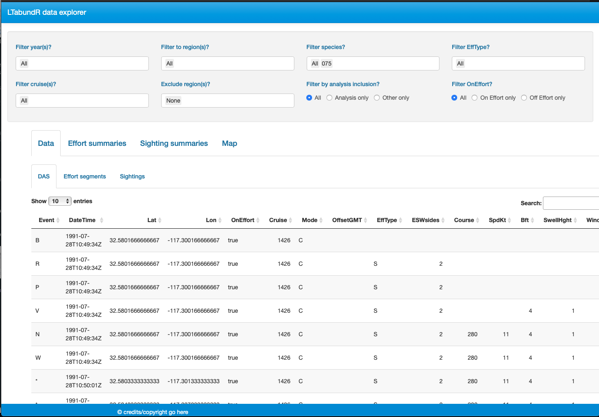
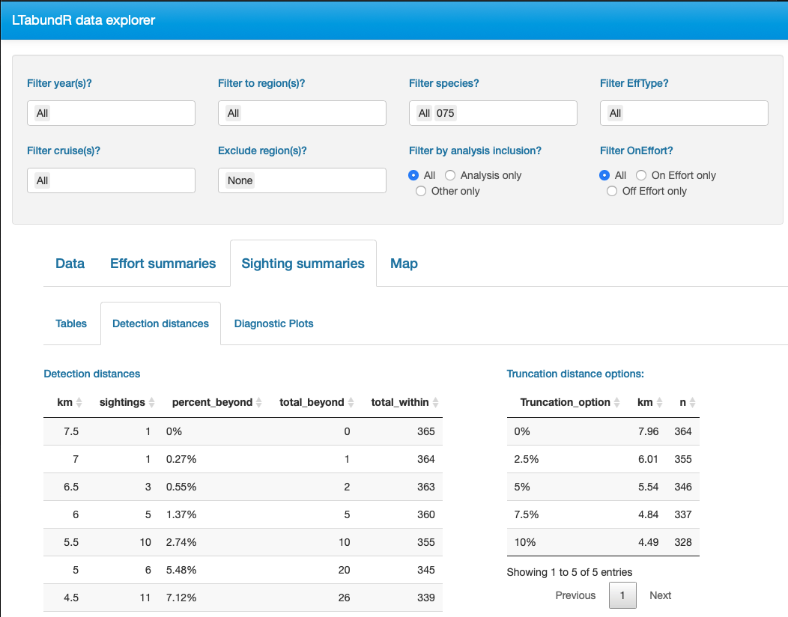
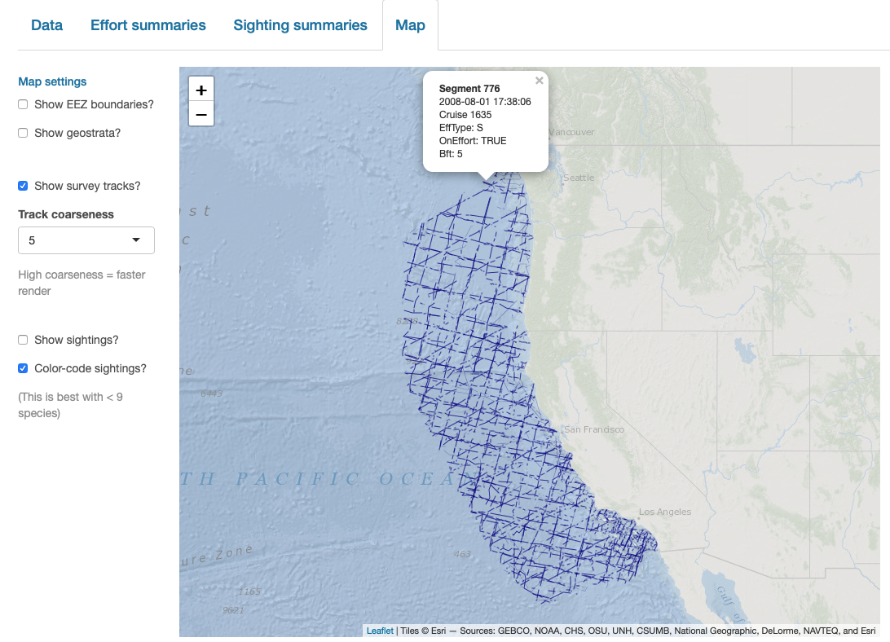

# Maps {#maps}

```{r, echo=FALSE, eval=TRUE, collapse=TRUE, include=FALSE}
library(dplyr)
library(magrittr)
library(LTabundR)
library(swfscDAS)
library(tmap)
data(whiceas2020_proc)
cruz <- whiceas2020_proc
```

To build a flexible system for mapping cruise data, we have the following functions:  

## Publishable maps {-}

### Base maps {-}  

Begin with a basic map, including EEZ borders:  

```{r, echo=TRUE, eval=TRUE, collapse=TRUE, message=FALSE, warning=FALSE, fig.width=6, fig.height=4}
m <- map_base(region='cnp')
m
```

We also have a base map for the California Current ... 

```{r, echo=TRUE, eval=TRUE, collapse=TRUE, message=FALSE, warning=FALSE, fig.width=6, fig.height=5}
m <- map_base(region='ccs')
m
```

And the ETP:  

```{r, echo=TRUE, eval=TRUE, collapse=TRUE, message=FALSE, warning=FALSE, fig.width=6, fig.height=4}
m <- map_base(region='etp')
m
```

### Add strata {-}  

Add your research strata to your map: 

```{r, echo=TRUE, eval=TRUE, collapse=TRUE, message=FALSE, warning=FALSE, fig.width=6, fig.height=4}
m <- map_base(region='cnp')
m <- map_strata(m, 
                cruz$settings, 
                region='cnp')
m
```

### Add survey tracks {-}  

```{r, echo=TRUE, eval=TRUE, collapse=TRUE, message=FALSE, warning=FALSE, fig.width=6, fig.height=4}
m1 <- map_effort(m, cruz)
m1
```

The defaults of `map_effort()` assume, for simplicity, that you want to see the segments to be included in density estimation for the first cohort specified in your settings.  You can adjust this and other defaults using the function arguments. 

#### Customizing effort {-}  

##### Inputs  {-}  

To demonstrate some of the customization options, consider this map that shows segments to be *excluded* from the `"distance"` (detection function) analysis for our second cohort (`fkw_insular`).

```{r, echo=TRUE, eval=TRUE, collapse=TRUE, message=FALSE, warning=FALSE, fig.width=6, fig.height=4}
map_effort(m, cruz,
           cohort = 2,
           use_type = c(FALSE),
           effort_color='firebrick',
           effort_stroke=2.5,
           effort_linetype=1,)
```


##### Color-code conditions {-}  

Your second customization option is to add format variables to the `segments` slot of the cohort of interest in the `cruz` object. This gives you full control of line color, thickness, and line-type according to whatever specifications you wish to set, e.g., color-coding by effort type or Beaufort sea state.  

This is possible because the function `map_effort()` looks for the variables `col` (line color), `lwd` (line thickness or stroke), and `lty` (line type) in the columns of `cruz$segments`. If these columns exist, the values therein will be used instead of the function defaults.  

For example, color-code by Beaufort scale:

```{r, echo=TRUE, eval=TRUE, collapse=TRUE, message=FALSE, warning=FALSE, fig.width=6, fig.height=4}
# Save copy of cruz object data to modify
cruz2 <- cruz
segments <- cruz2$cohorts$default$segments

# Add column `col`: color code by BFT sea state
bft_colors <- c('steelblue4','steelblue2','cadetblue1','grey')
segments$col <- bft_colors[4]
segments$col[ segments$avgBft <= 7 ] <- bft_colors[3] # bft 5 +
segments$col[ segments$avgBft <= 4 ] <- bft_colors[2] # bft 3 - 4
segments$col[ segments$avgBft <= 2 ] <- bft_colors[1] # bft 0 -2

# Update sub_segments slot in `cruz` object
cruz2$cohorts$default$segments <- segments

# Update map 
m_custom2 <- map_effort(m, cruz2)

# Add legend using native functions from mapping package `tmap`
m_custom2 <- 
  m_custom2 + 
  tmap::tm_add_legend('line', 
	                    col = bft_colors,
	                    lwd = 3,
	                    labels = c(' 0 - 2', 
	                               ' 3 - 4', 
	                               ' 5 +', 
	                               ' no data'),
	                     title="Beaufort sea state") +
  tmap::tm_layout(legend.position=c('left','bottom'))

# Show map
m_custom2
```

### Add sightings {-}  

Use the function `map_sightings()` to add sightings to your map:  

```{r, echo=TRUE, eval=TRUE, collapse=TRUE, message=FALSE, warning=FALSE, fig.width=6, fig.height=4}
map_sightings(m, cruz)
```

#### Customizing sightings {-}  

To demonstrate some of the customization options, consider this map that shows sightings of false killer whales with custom dot color, shape, and size: 

```{r, echo=TRUE, eval=TRUE, collapse=TRUE, message=FALSE, warning=FALSE, fig.width=6, fig.height=4}
map_sightings(m,
              cruz,
              include_species = '033',
              color_base = 'purple',
              shape_base = 18,
              size_base = 1)
```

Next is a map of humpback whales and sperm whales, color-coded by species and shape-coded by whether or not the sighting will be included in the analysis: 

```{r, echo=TRUE, eval=TRUE, collapse=TRUE, message=FALSE, warning=FALSE, fig.width=6, fig.height=4}
map_sightings(m, 
              cruz,
              include_species = c('076','046'),
              color_code = TRUE,
              shape_code = TRUE)
```

### Overview {-} 

Here is an overview of the steps needed to map strata, survey tracks, and sightings all together:

```{r, echo=TRUE, eval=TRUE, collapse=TRUE, message=FALSE, warning=FALSE, fig.width=6, fig.height=4}
m <- map_base('cnp') 
m <- map_strata(m, cruz$settings)
m <- map_effort(m, cruz)
m <- map_sightings(m, cruz, size_base=.4)
m 
```

## Interactive maps {-}

`LTabundR` also has an interactive map function, which maps survey data using the `leaflet` package.  

```{r, echo=TRUE, eval=TRUE, collapse=TRUE, message=FALSE, warning=FALSE, fig.width=6, fig.height=4}
 map_cruz(cruz,
          cohort=1,
          eez_show=FALSE,
          strata_show=FALSE,
          effort_show=TRUE,
          effort_resolution=1,
          sightings_show=TRUE,
          sightings_color = 'firebrick',
          verbose=FALSE)
```

Note that you can also click on sightings and tracklines to see their details. Refer to the documentation for this function (`?map_cruz`) to see all the options available for stylizing these maps.

## Interactive dashboard {-}

Finally, note that `LTabundR` comes with an interactive data explorer app (a `Shiny` app) for filtering survey data according to effort scenario and species code, toggling `map_cruz()` settings, and reviewing summary tables of effort and sightings (including inspection of truncation distances). 

```{r, echo=TRUE, eval=FALSE, collapse=TRUE, message=FALSE, warning=FALSE, fig.width=6, fig.height=4}
cruz_explorer(cruz)
```

*Screenshots from this app:*

&nbsp;  
<center>
{width=85%}
&nbsp;  
{width=85%}
&nbsp;  
{width=85%}
&nbsp;  
{width=85%}
&nbsp;  
{width=85%}
</center>


